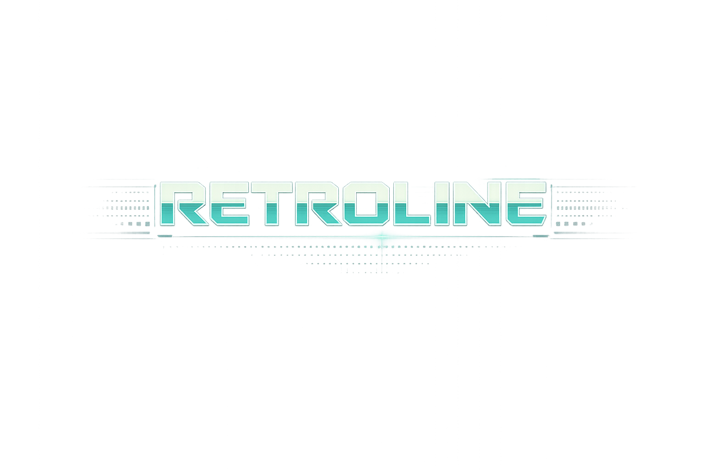

<p align="center">
  
</p>

<h1 align="center">retroline.nvim</h1>

<p align="center">
  <strong>Animated statusline for Neovim</strong><br>
</p>

<p align="center">
  <a href="https://neovim.io">
    
  </a>
</p>

---

## Features

- Timer-driven status animation with multiple presets
- Smart idle mode: pauses animation timer when idle, wakes on activity
- Animated mode indicator (`N`, `I`, `V`, etc.) with marker animations
- Smart path shortening for deep project files
- Cached diagnostics component with severity highlights
- Adaptive layouts (`full`, `compact`, `minimal`) based on window width
- Optional retro rendering style with bracketed chips, retro presets, and compact-biased layout thresholds
- Optional Git branch and LSP client segments
- Built-in themed statusline renderer (`retroline.statusline()`)
- Works with native Neovim statusline format

## Install

### `vim.pack`

Neovim 0.12+ includes `vim.pack`, a built-in package manager. Add this to `init.lua`:

```lua
vim.pack.add({
  {
    src = "https://github.com/valonmulolli/retroline.nvim",
    name = "retroline.nvim",
  },
})

require("retroline").setup({
  animation = "orbit",
})
```

### `lazy.nvim`

```lua
{
  "valonmulolli/retroline.nvim",
  name = "retroline.nvim",
  config = function()
    require("retroline").setup({
      animation = "orbit",
    })
  end,
}
```

## Usage with native statusline

```lua
require("retroline").enable_statusline()
```

## Tests

```sh
nvim --headless -u NONE -i NONE --cmd "set rtp+=. shadafile=NONE" -l scripts/test.lua
```

## API

- `require("retroline").setup(opts)`
- `require("retroline").start()`
- `require("retroline").stop()`
- `require("retroline").toggle()`
- `require("retroline").component()`
- `require("retroline").mode_component(opts?)`
- `require("retroline").path_component(opts?)`
- `require("retroline").diagnostic_component(opts?)`
- `require("retroline").statusline()`
- `require("retroline").enable_statusline()`
- `require("retroline").disable_statusline()`
- `require("retroline").is_running()`
- `require("retroline").set_animation(name)`
- `require("retroline").next_animation()`
- `require("retroline").current_animation()`
- `require("retroline").list_animations()`
- `require("retroline").set_mode_animation(name)`
- `require("retroline").next_mode_animation()`
- `require("retroline").current_mode_animation()`
- `require("retroline").list_mode_animations()`
- `require("retroline").set_diagnostic_animation(name)`
- `require("retroline").next_diagnostic_animation()`
- `require("retroline").current_diagnostic_animation()`
- `require("retroline").list_diagnostic_animations()`

## Status Animations

- `dots`
- `line`
- `pulse`
- `meter`
- `bounce`
- `snake`
- `trail`
- `scan`
- `binary`
- `orbit`
- `tunnel`
- `ladder`
- `rover`
- `flicker`
- `zipper`
- `ramps`
- `retro_scan`
- `retro_blink`
- `retro_boot`
- `retro_modem`
- `retro_probe`

## Mode Marker Animations

- `spin`
- `pulse`
- `wave`
- `bounce`
- `chevron`
- `blink`
- `dot3`
- `arrow`
- `spark`
- `steps`
- `retro_cursor`
- `retro_block`
- `retro_ticks`
- `retro_prompt`
- `retro_gate`

## Diagnostic Animations (ASCII)

- `ascii_alert`
- `ascii_wave`
- `ascii_blink`
- `ascii_meter`
- `retro_alarm`
- `retro_panel`

## Default Config

```lua
{
  enabled = true,
  animation = "dots",
  interval = 150,
  frames = { ".  ", ".. ", "..." },
  mode = {
    style = "short", -- "short" | "long"
    animate = true,
    animation = "spin", -- includes retro_* mode marker presets too
    separator = "",
  },
  path = {
    style = "relative", -- "relative" | "absolute" | "filename"
    max_length = 56,
    shorten_len = 1,
    keep_segments = 2,
    trunc_prefix = ".../",
  },
  diagnostic = {
    enabled = true,
    scope = "buffer", -- "buffer" | "workspace"
    style = "full", -- "minimal" | "compact" | "full"
    animate = true,
    animate_severities = { "ERROR", "WARN", "INFO", "HINT", "OK" },
    animation = "ascii_alert", -- includes "retro_alarm"
    show_zero = false,
    use_highlights = true,
    separator = " ",
    empty = "OK",
    labels = {
      ERROR = "E",
      WARN = "W",
      INFO = "I",
      HINT = "H",
    },
  },
  statusline = {
    style = "rounded", -- "rounded" | "square" | "none"
    global = true, -- set laststatus=3
    transparent = false, -- keep retroline highlight backgrounds transparent
    sidebar_minimal = true,
    sidebar_filetypes = {
      "snacks_layout_box",
      "snacks_picker_input",
      "snacks_picker_list",
      "snacks_picker_preview",
      "neo-tree",
      "NvimTree",
      "oil",
      "qf",
    },
    sidebar_labels = {
      snacks_layout_box = "Explorer",
      snacks_picker_input = "Search",
      snacks_picker_list = "Results",
      snacks_picker_preview = "Preview",
      ["neo-tree"] = "Explorer",
      NvimTree = "Explorer",
      oil = "Explorer",
      qf = "Quickfix",
    },
    retro = false,
    -- When retro = true and you do not override animations explicitly:
    -- animation = "retro_scan"
    -- mode.animation = "retro_cursor"
    -- diagnostic.animation = "retro_alarm"
    adaptive = true,
    compact_width = 108,
    minimal_width = 82,
    show_filetype = true,
    show_flags = true,
    show_git = true,
    show_lsp = true,
    show_location = true,
    show_progress = true,
    pad = " ",
  },
  performance = {
    smart_idle = true,
    idle_timeout = 1200,
    stop_timer_on_idle = true,
    active_mode_prefixes = { "i", "R", "v", "V", "\22", "c", "s", "t" },
    diagnostic_pulse = 1600,
  },
  skip_filetypes = { "snacks_dashboard", "dashboard", "alpha", "starter", "snacks_layout_box" },
}
```

## Internal Layout

- `lua/retroline/state.lua` defaults, runtime state, animation tables
- `lua/retroline/animations.lua` status animation logic
- `lua/retroline/mode.lua` mode labels and mode animation logic
- `lua/retroline/path.lua` path formatting and shortening
- `lua/retroline/diagnostics.lua` cached diagnostics component
- `lua/retroline/highlights.lua` retroline highlight groups
- `lua/retroline/statusline.lua` statusline module facade
- `lua/retroline/statusline/options.lua` statusline option normalization and layout selection
- `lua/retroline/statusline/style.lua` style helpers
- `lua/retroline/statusline/context.lua` cached git/lsp context helpers
- `lua/retroline/statusline/render.lua` built-in statusline renderer
- `lua/retroline/statusline/manage.lua` enable/disable and local-window statusline management
- `lua/retroline/lifecycle.lua` timer lifecycle/start-stop
- `lua/retroline/setup.lua` setup flow and autocmd wiring
- `lua/retroline/api/base.lua` base runtime/component API
- `lua/retroline/api/presets.lua` animation preset API
- `lua/retroline/init.lua` public API facade
